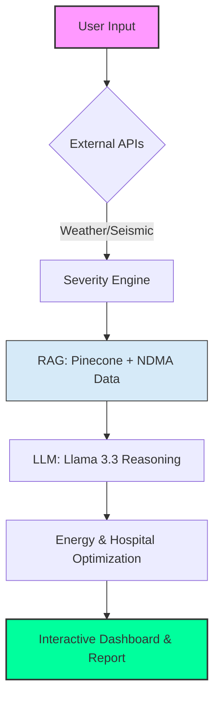

# 🚀 Green Crisis Grid AI  
### Autonomous Disaster Response & Energy Optimization System

---

## 🧠 Overview

**Green Crisis Grid AI** is an AI-powered emergency command system that simulates a national-level disaster response center. It combines real-time weather data, **Retrieval-Augmented Generation (RAG)**, hospital prioritization, and intelligent energy allocation to generate structured crisis response plans.

It functions as a digital **Emergency Operations Center (EOC)** that supports fast, data-driven disaster decision-making.

---

## ⚠️ Problem Statement

During disasters such as floods, heatwaves, and earthquakes, response systems face:

- **Delayed decision-making** due to information overload.
- **Fragmented data sources** across different agencies.
- **Lack of real-time intelligence** for immediate field action.
- **Inefficient resource allocation** (specifically energy grids).
- **No centralized AI command system** to bridge the gap.

This leads to slower emergency response and increased risk to human lives.

---

## 💡 Solution

Green Crisis Grid AI solves this by building an autonomous crisis intelligence system that:

- **Detects disaster severity** using real-time weather APIs.
- **Retrieves NDMA emergency intelligence** using RAG (Pinecone vector database).
- **Prioritizes hospitals** based on location and real-time energy needs.
- **Simulates emergency energy redistribution** from green sources.
- **Generates structured government-level reports** using Meta-Llama 3.3.
- **Visualizes crisis zones** on an interactive PyDeck map.

---

## ⚙️ Key Features

- 🌍 **Real-time Detection:** Automated monitoring for Heatwaves, Floods, Fire, and Earthquakes.
- 🧠 **RAG Intelligence:** Context-aware retrieval using Pinecone + `bge-large` embeddings.
- 🏥 **Medical Prioritization:** Logic-based hospital routing and status monitoring.
- ⚡ **Energy Mesh:** Autonomous solar/battery energy redistribution simulation.
- 🤖 **AI-Generated Directives:** Professional briefings powered by Llama 3.3.
- 🗺️ **Interactive GIS:** Real-time crisis zone mapping and spatial visualization.

---

## 🏗️ System Architecture

---
🧰 Tech Stack
Frontend: Streamlit

Logic: Python

Reasoning Engine: Meta-Llama 3.3 (via Together AI)

Vector DB: Pinecone (Serverless)

Embeddings: BAAI/bge-large-en-v1.5

APIs: Open-Meteo (Weather), USGS (Earthquake)

Visuals: PyDeck (Geospatial)

Data: BeautifulSoup (NDMA Scraping)

📊 Output Report Includes
When the system triggers a crisis protocol, it generates a comprehensive intelligence brief covering:

Risk Level (1-10): Instant severity assessment.

Situation Analysis: Real-time data synthesis.

Immediate Actions: Critical first-step maneuvers.

Evacuation Plan: Logic-based routing for civilians.

Hospital Response: Prioritizing medical facilities for power and resources.

Government Advisory: Drafted official communications.

Executive Summary: High-level overview for fast decision-making.

🚀 Impact
Seconds, not hours: Dramatically faster disaster response decisions.

Grounding: AI-powered simulation that stays within official NDMA protocols using RAG.

Efficiency: Improved resource allocation for critical healthcare infrastructure.

Visibility: Real-time crisis visualization for higher-level command centers.

🔗 Live Demo
View Live App

📂 Project Structure
app.py: Main Streamlit application and UI logic.

requirements.txt: Project dependencies and environment setup.

data/: NDMA scraped knowledge base (Primary vector source).

utils/: Helper functions for API calls, RAG logic, and data processing.

README.md: System documentation and architecture overview.

👨‍💻 Author
Nafia Aamir AI Researcher | RAG Systems Specialist | Full Stack AI Applications

🏁 Conclusion
Green Crisis Grid AI demonstrates how AI can transform disaster management into an autonomous, real-time decision-making system. By bridging the gap between raw environmental data and actionable policy, it paves the way for the next generation of national-scale emergency response systems.
